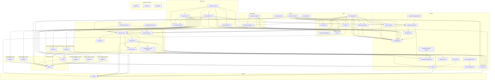

```mermaid
graph TD
  subgraph lib_cli ["lib/cli"]
    direction TB
    lib_cli_mcp_proxy_template_js["mcp-proxy-template.js"]
    lib_cli_cli_actions_ts["cli-actions.ts"]
    lib_cli_cli_commands_ts["cli-commands.ts"]
    lib_cli_cli_config_ts["cli-config.ts"]
    lib_cli_cli_ui_ts["cli-ui.ts"]
    lib_cli_daemon_manager_ts["daemon-manager.ts"]
  end
  subgraph lib_core ["lib/core"]
    direction TB
    lib_core_dependency_graph_builder_ts["dependency-graph-builder.ts"]
    lib_core_file_filters_ts["file-filters.ts"]
    lib_core_file_indexer_ts["file-indexer.ts"]
    lib_core_indexer_core_test_ts["indexer-core.test.ts"]
    lib_core_indexer_core_ts["indexer-core.ts"]
    lib_core_project_detector_test_ts["project-detector.test.ts"]
    lib_core_project_detector_ts["project-detector.ts"]
    lib_core_qdrant_client_ts["qdrant-client.ts"]
  end
  subgraph lib_managers ["lib/managers"]
    direction TB
    lib_managers_collection_manager_ts["collection-manager.ts"]
    lib_managers_project_manager_ts["project-manager.ts"]
  end
  subgraph lib_mcp ["lib/mcp"]
    direction TB
    lib_mcp_mcp_server_ts["mcp-server.ts"]
    lib_mcp_mcp_test_runner_ts["mcp-test-runner.ts"]
    lib_mcp_mcp_tools_test_ts["mcp-tools.test.ts"]
  end
  subgraph lib_services ["lib/services"]
    direction TB
    lib_services_inactivity_manager_ts["inactivity-manager.ts"]
    lib_services_indexer_service_ts["indexer-service.ts"]
    lib_services_mcp_service_ts["mcp-service.ts"]
    lib_services_project_watcher_ts["project-watcher.ts"]
    lib_services_service_lifecycle_ts["service-lifecycle.ts"]
  end
  subgraph lib_tools_common ["lib/tools/common"]
    direction TB
    lib_tools_common_types_ts["types.ts"]
    lib_tools_common_utils_ts["utils.ts"]
  end
  subgraph lib_tools_find_usages ["lib/tools/find-usages"]
    direction TB
    lib_tools_find_usages_handler_ts["handler.ts"]
  end
  subgraph lib_tools_get_dependency_graph ["lib/tools/get-dependency-graph"]
    direction TB
    lib_tools_get_dependency_graph_handler_ts["handler.ts"]
  end
  subgraph lib_tools_get_file_outline ["lib/tools/get-file-outline"]
    direction TB
    lib_tools_get_file_outline_handler_ts["handler.ts"]
  end
  subgraph lib_tools_get_project_structure ["lib/tools/get-project-structure"]
    direction TB
    lib_tools_get_project_structure_handler_ts["handler.ts"]
  end
  subgraph lib_tools_get_reverse_dependencies ["lib/tools/get-reverse-dependencies"]
    direction TB
    lib_tools_get_reverse_dependencies_handler_ts["handler.ts"]
  end
  subgraph lib_tools_search_codebase ["lib/tools/search-codebase"]
    direction TB
    lib_tools_search_codebase_handler_ts["handler.ts"]
  end
  subgraph lib_tools_search_symbols ["lib/tools/search-symbols"]
    direction TB
    lib_tools_search_symbols_handler_ts["handler.ts"]
  end
  subgraph lib_types ["lib/types"]
    direction TB
    lib_types_index_ts["index.ts"]
  end
  subgraph lib_utils ["lib/utils"]
    direction TB
    lib_utils_ast_js_test_ts["ast-js.test.ts"]
    lib_utils_ast_js_ts["ast-js.ts"]
    lib_utils_config_global_ts["config-global.ts"]
    lib_utils_dependency_graph_db_test_ts["dependency-graph-db.test.ts"]
    lib_utils_dependency_graph_db_ts["dependency-graph-db.ts"]
    lib_utils_fake_code_agent_test_ts["fake-code-agent.test.ts"]
    lib_utils_fake_code_agent_ts["fake-code-agent.ts"]
    lib_utils_path_resolver_ts["path-resolver.ts"]
    lib_utils_snapshot_db_ts["snapshot-db.ts"]
    lib_utils_snapshot_manager_test_ts["snapshot-manager.test.ts"]
    lib_utils_snapshot_manager_ts["snapshot-manager.ts"]
    lib_utils_system_check_ts["system-check.ts"]
    lib_utils_tree_sitter_ts["tree-sitter.ts"]
  end
  subgraph lib_utils_test_fixtures ["lib/utils/test_fixtures"]
    direction TB
    lib_utils_test_fixtures_sample_js["sample.js"]
    lib_utils_test_fixtures_sample_tsx["sample.tsx"]
    lib_utils_test_fixtures_sample_ts["sample.ts"]
  end

  %% Edges
  lib_cli_cli_commands_ts --> lib_cli_cli_ui_ts
  lib_cli_cli_commands_ts --> lib_cli_cli_config_ts
  lib_cli_cli_commands_ts --> lib_core_project_detector_ts
  lib_cli_cli_commands_ts --> lib_core_indexer_core_ts
  lib_cli_cli_commands_ts --> lib_utils_system_check_ts
  lib_cli_cli_commands_ts --> lib_utils_config_global_ts
  lib_cli_cli_commands_ts --> lib_utils_snapshot_manager_ts
  lib_cli_cli_commands_ts --> lib_cli_cli_config_ts
  lib_cli_cli_commands_ts --> lib_cli_daemon_manager_ts
  lib_cli_cli_commands_ts --> lib_managers_collection_manager_ts
  lib_cli_cli_commands_ts --> lib_utils_config_global_ts
  lib_cli_cli_commands_ts --> lib_utils_config_global_ts
  lib_cli_cli_config_ts --> lib_cli_cli_ui_ts
  lib_cli_cli_config_ts --> lib_utils_config_global_ts
  lib_cli_cli_config_ts --> lib_types_index_ts
  lib_cli_daemon_manager_ts --> lib_utils_config_global_ts
  lib_managers_collection_manager_ts --> lib_cli_cli_ui_ts
  lib_managers_collection_manager_ts --> lib_core_indexer_core_ts
  lib_managers_project_manager_ts --> lib_cli_cli_ui_ts
  lib_managers_project_manager_ts --> lib_core_indexer_core_ts
  lib_managers_project_manager_ts --> lib_utils_config_global_ts
  lib_managers_project_manager_ts --> lib_managers_collection_manager_ts
  lib_managers_project_manager_ts --> lib_utils_snapshot_manager_ts
  lib_mcp_mcp_server_ts --> lib_utils_tree_sitter_ts
  lib_mcp_mcp_server_ts --> lib_cli_cli_ui_ts
  lib_mcp_mcp_server_ts --> lib_utils_config_global_ts
  lib_mcp_mcp_test_runner_ts --> lib_cli_cli_actions_ts
  lib_mcp_mcp_test_runner_ts --> lib_cli_cli_ui_ts
  lib_mcp_mcp_test_runner_ts --> lib_utils_config_global_ts
  lib_mcp_mcp_test_runner_ts --> lib_cli_cli_config_ts
  lib_mcp_mcp_test_runner_ts --> lib_core_indexer_core_ts
  lib_mcp_mcp_test_runner_ts --> lib_cli_daemon_manager_ts
  lib_mcp_mcp_tools_test_ts --> lib_utils_tree_sitter_ts
  lib_mcp_mcp_tools_test_ts --> lib_tools_common_utils_ts
  lib_mcp_mcp_tools_test_ts --> lib_tools_common_types_ts
  lib_core_dependency_graph_builder_ts --> lib_utils_ast_js_ts
  lib_core_dependency_graph_builder_ts --> lib_utils_tree_sitter_ts
  lib_core_dependency_graph_builder_ts --> lib_utils_path_resolver_ts
  lib_core_dependency_graph_builder_ts --> lib_utils_dependency_graph_db_ts
  lib_core_dependency_graph_builder_ts --> lib_tools_common_utils_ts
  lib_core_file_indexer_ts --> lib_utils_ast_js_ts
  lib_core_file_indexer_ts --> lib_utils_tree_sitter_ts
  lib_core_file_indexer_ts --> lib_core_qdrant_client_ts
  lib_core_file_indexer_ts --> lib_core_dependency_graph_builder_ts
  lib_core_file_indexer_ts --> lib_types_index_ts
  lib_core_indexer_core_test_ts --> lib_utils_tree_sitter_ts
  lib_core_indexer_core_test_ts --> lib_core_indexer_core_ts
  lib_core_indexer_core_ts --> lib_utils_tree_sitter_ts
  lib_core_indexer_core_ts --> lib_core_qdrant_client_ts
  lib_core_indexer_core_ts --> lib_core_file_indexer_ts
  lib_core_indexer_core_ts --> lib_core_file_filters_ts
  lib_core_indexer_core_ts --> lib_types_index_ts
  lib_core_indexer_core_ts --> lib_core_qdrant_client_ts
  lib_core_project_detector_test_ts --> lib_core_project_detector_ts
  lib_core_qdrant_client_ts --> lib_types_index_ts
  lib_services_indexer_service_ts --> lib_utils_tree_sitter_ts
  lib_services_indexer_service_ts --> lib_utils_config_global_ts
  lib_services_indexer_service_ts --> lib_cli_cli_ui_ts
  lib_services_indexer_service_ts --> lib_services_project_watcher_ts
  lib_services_indexer_service_ts --> lib_services_inactivity_manager_ts
  lib_services_indexer_service_ts --> lib_services_service_lifecycle_ts
  lib_services_indexer_service_ts --> lib_services_mcp_service_ts
  lib_services_mcp_service_ts --> lib_services_inactivity_manager_ts
  lib_services_mcp_service_ts --> lib_utils_config_global_ts
  lib_services_mcp_service_ts --> lib_core_indexer_core_ts
  lib_services_mcp_service_ts --> lib_tools_common_utils_ts
  lib_services_mcp_service_ts --> lib_tools_search_codebase_handler_ts
  lib_services_mcp_service_ts --> lib_tools_search_symbols_handler_ts
  lib_services_mcp_service_ts --> lib_tools_get_file_outline_handler_ts
  lib_services_mcp_service_ts --> lib_tools_get_project_structure_handler_ts
  lib_services_mcp_service_ts --> lib_tools_find_usages_handler_ts
  lib_services_mcp_service_ts --> lib_tools_get_dependency_graph_handler_ts
  lib_services_mcp_service_ts --> lib_tools_get_reverse_dependencies_handler_ts
  lib_services_mcp_service_ts --> lib_tools_common_types_ts
  lib_services_project_watcher_ts --> lib_cli_cli_ui_ts
  lib_services_project_watcher_ts --> lib_core_indexer_core_ts
  lib_services_project_watcher_ts --> lib_utils_config_global_ts
  lib_services_project_watcher_ts --> lib_utils_snapshot_manager_ts
  lib_services_project_watcher_ts --> lib_services_inactivity_manager_ts
  lib_services_project_watcher_ts --> lib_utils_dependency_graph_db_ts
  lib_services_project_watcher_ts --> lib_types_index_ts
  lib_services_service_lifecycle_ts --> lib_utils_config_global_ts
  lib_utils_ast_js_test_ts --> lib_utils_ast_js_ts
  lib_utils_ast_js_ts --> lib_types_index_ts
  lib_utils_dependency_graph_db_test_ts --> lib_utils_dependency_graph_db_ts
  lib_utils_fake_code_agent_test_ts --> lib_utils_fake_code_agent_ts
  lib_utils_snapshot_db_ts --> lib_utils_config_global_ts
  lib_utils_snapshot_manager_test_ts --> lib_utils_snapshot_manager_ts
  lib_utils_snapshot_manager_ts --> lib_core_indexer_core_ts
  lib_utils_snapshot_manager_ts --> lib_utils_config_global_ts
  lib_utils_snapshot_manager_ts --> lib_utils_snapshot_db_ts
  lib_utils_tree_sitter_ts --> lib_types_index_ts
  lib_tools_common_utils_ts --> lib_utils_ast_js_ts
  lib_tools_common_utils_ts --> lib_utils_tree_sitter_ts
  lib_tools_common_utils_ts --> lib_tools_common_types_ts
  lib_tools_find_usages_handler_ts --> lib_tools_common_types_ts
  lib_tools_get_file_outline_handler_ts --> lib_tools_common_types_ts
  lib_tools_get_dependency_graph_handler_ts --> lib_tools_common_types_ts
  lib_tools_get_dependency_graph_handler_ts --> lib_utils_dependency_graph_db_ts
  lib_tools_get_project_structure_handler_ts --> lib_tools_common_types_ts
  lib_tools_get_reverse_dependencies_handler_ts --> lib_tools_common_types_ts
  lib_tools_get_reverse_dependencies_handler_ts --> lib_utils_dependency_graph_db_ts
  lib_tools_search_codebase_handler_ts --> lib_tools_common_types_ts
  lib_tools_search_symbols_handler_ts --> lib_tools_common_types_ts
```
